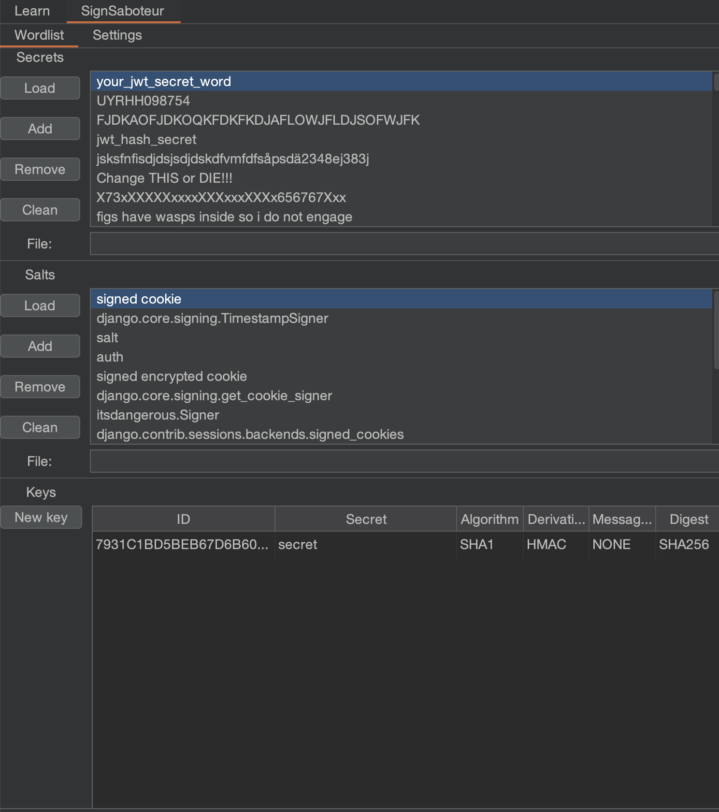
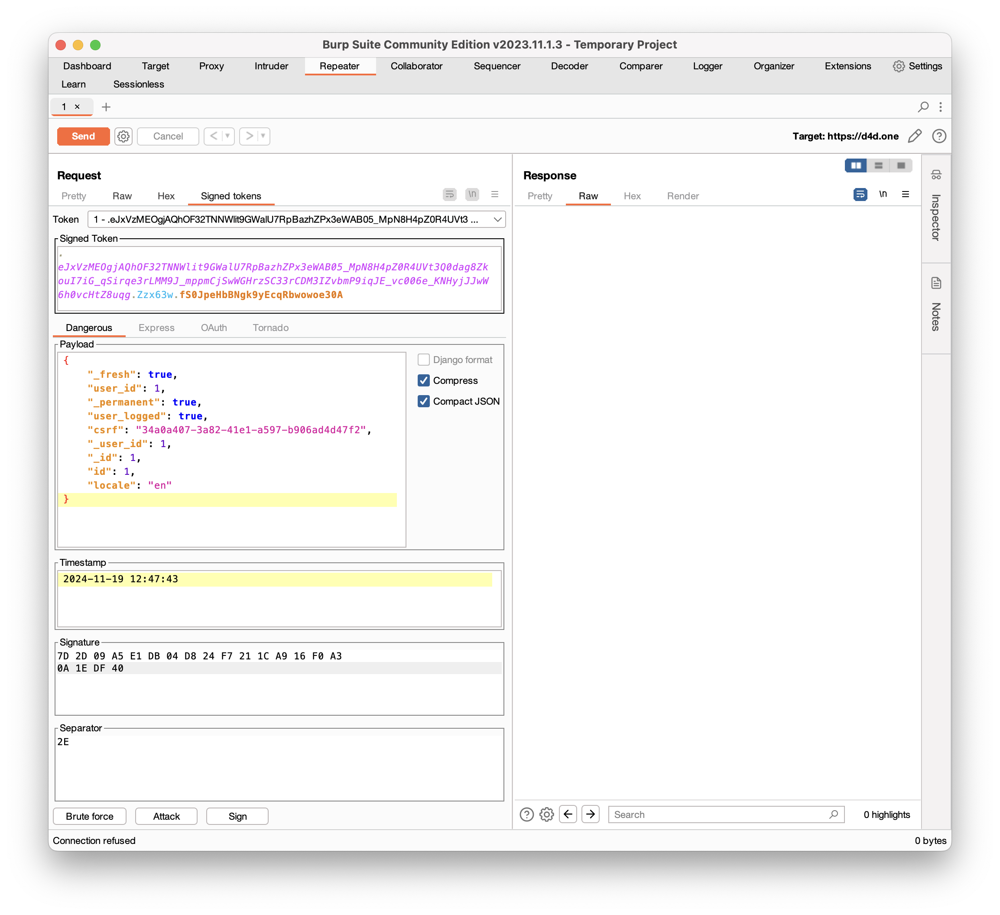
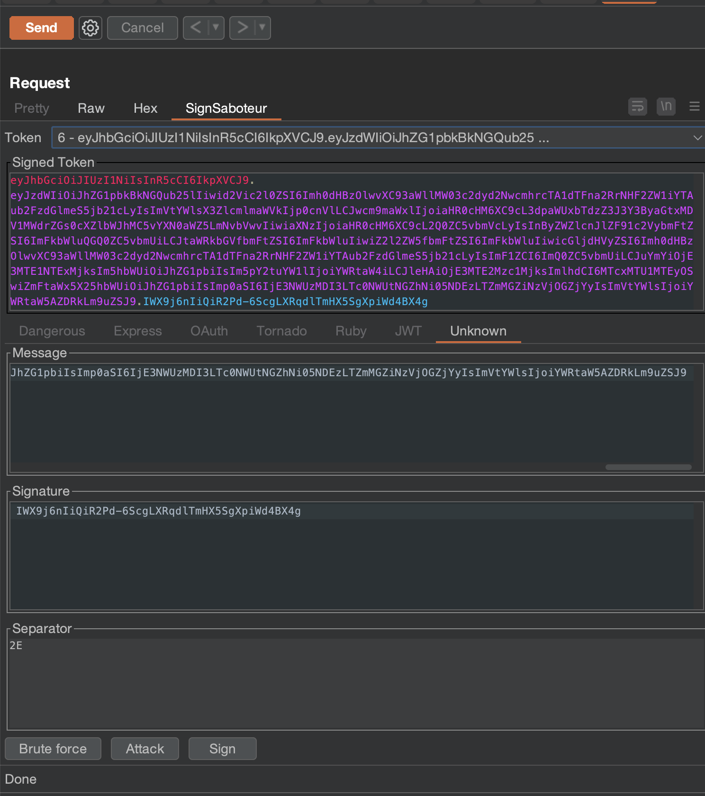
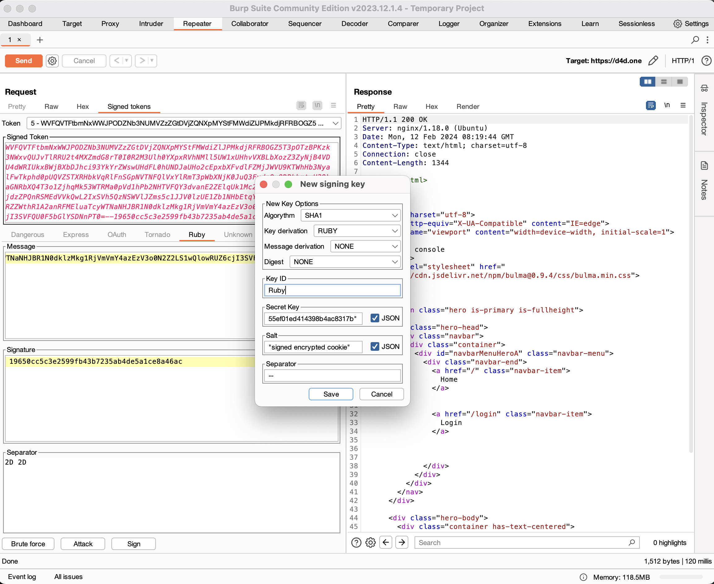
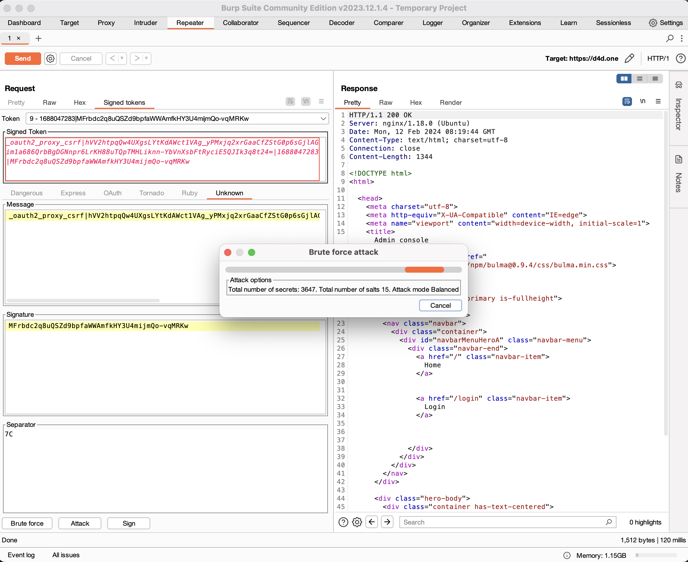
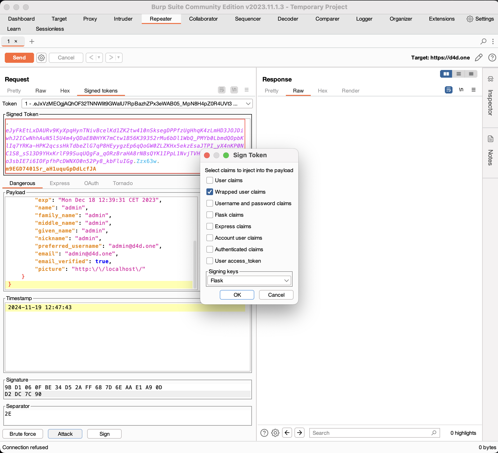

# SignSaboteur

SignSaboteur is a Burp Suite extension for editing, signing, verifying, and attacking signed tokens. 
It supports different types of tokens: [Django TimestampSigner](https://docs.djangoproject.com/en/5.0/topics/signing/#verifying-timestamped-values), [ItsDangerous Signer](https://itsdangerous.palletsprojects.com/en/2.1.x/signer/), [Express cookie-session middleware](https://expressjs.com/en/resources/middleware/cookie-session.html), [OAuth2 Proxy](https://github.com/oauth2-proxy/oauth2-proxy), [Tornado’s signed cookies](https://www.tornadoweb.org/en/stable/guide/security.html), [Ruby Rails Signed cookies](https://api.rubyonrails.org/classes/ActiveSupport/MessageVerifier.html), [Nimbus JOSE + JWT](https://bitbucket.org/connect2id/nimbus-jose-jwt/src/master/)
and Unknown signed string.

It provides automatic detection and in-line editing of token within HTTP requests/responses and WebSocket messages,
signing of tokens and automation of brute force attacks against signed tokens implementations.

It was inspired by Fraser Winterborn and Dolph Flynn JWT Token extension. The original source code can be
found [here](https://github.com/blackberry/jwt-editor) and [here](https://github.com/DolphFlynn/jwt-editor).

## Build Instructions

* Ensure that Java JDK 17 or newer is installed
* From root of project, run the command `./gradlew jar`
* This should place the JAR file `sign-saboteur-1.0.2.jar` within the `build/libs` directory
* This can be loaded into Burp by navigating to the `Extensions` tab, `Installed` sub-tab, clicking `Add` and loading
  the JAR file
* This BApp is using the newer Montoya API, so it's best to use the latest version of Burp (try the earlier adopter
  channel if there are issues with the latest stable release)

## Wordlist View

The `Wordlist View` allows to import secrets and salts list files. Extension has own prebuild dictionary lists. Most
secrets are taken from [jwt-secrets](https://github.com/wallarm/jwt-secrets). As an
option, [Flask-Unsign-Wordlist](https://github.com/Paradoxis/Flask-Unsign-Wordlist) can be used. Extension supports JSON
strings format for special chars, to use it quot the secret string with `"`.

## Editor View

The `Editor View` supports a number of signed tokens: Django, Dangerous, Flask, Express, OAuth2 and Tornado. It allows
modification of the signed tokens at Burp Suite's HTTP Request/Response view in the Proxy, History and Repeater tools.

The Dangerous tab can be used for both, `Flask` and `Django` tokens, which are selected depending on whether a Dangerous
or Django token is detected.

The Unknown tab can be used to brute force unknown signed strings. Guessing mode works only with _Balanced_ and _Deep_
brute force attacks. It supports different message derivation technics, including:

* _None_ message will be used as is
* _CONCAT_ separator byte will be removed from the message and that new value will be used to calculate signature
* _Tornado_ separator byte will be added to the end of the message string

### Editable Fields

A JSON text editor is provided to edit each component that contain JSON content:

* Dangerous Payload
* Django Payload (except pickle serialized payload)
* Express Payload
* JWT Payload

A timestamp editor is provided to edit each component that contain it:

* Dangerous timestamp
* Django timestamp
* OAuth2 Proxy timestamp
* Tornado timestamp

A hex editor is provided to all signed tokens, except Express signatures. __NOTE__ Express Tab doesn't support signature
auto update yet. Please copy it manually to corresponding signature cookie.

### Sign

`Sign` presents a signing dialog that can be used to update the Signature by signing the token using a key from
the `Keys View` that has signing capabilities

### Brute force

`Brute force` will attempt to find secret key that was used for signature generation. If a secret key was found, a
dialog will be presented.

The `Brute force` option implements three types of attacks against signed tokens Signatures:

* _Known keys_ will use previously found secret keys only
* _Fast_ will use default hashing algorithm and key derivation
* _Balanced_ will use all known key derivation technics, except PBKDF2WithHmacSHA1, PBKDF2WithHmacSHA256
* _Deep_ will use all key derivation technics, including different types supported by Ruby Rails framework

### Attack

The `Attack` option implements eight well-known authorization attacks against signed tokens:

* User claims
* Wrapped user claims
* Username and password claims
* Flask claims
* Express claims
* Account user claims
* Authenticated claims
* User access_token

These are described in more detail below.

# Attacks

All of these attacks can be used together. Please bear in mind that extension doesn't support token payload modification
at Attack mod, so your payload will be replaced with new one.

### User claims

OpenID connect ID token format usually used by signing libraries to store information about authenticated user.
Extension will generate placeholder for `admin` user ID token.

### Wrapped user claims

Same as `User claims` attack but will put it into `user` JSON attribute.

### Username and password claims

Another common way to store user details is `username` and `password` JSON attributes. Extension will generate
placeholder for `admin` user.

### Flask claims

Flask authenticated user session information if stored at client side should include `id` and `_id` and `user_id`
or `_user_id` JSON attribute. Extension will generate session for the first user, usually admin.

### Express claims

Express framework uses `passport` JSON attribute to store user details. Extension will generate placeholder for `admin`
user.

### Account user claims

Some frameworks may use `account` wrapper to store information about authenticated user. For exploitation, it might be
required to use `Authenticated claims` too.

### Authenticated claims

The Authenticated claims implements 12 well-known authorization flags.

### User access_token

The `User access_token` option generated JWT OpenID connect ID token signed with the same key and same hashing algorithm
without any key derivation preformed.

